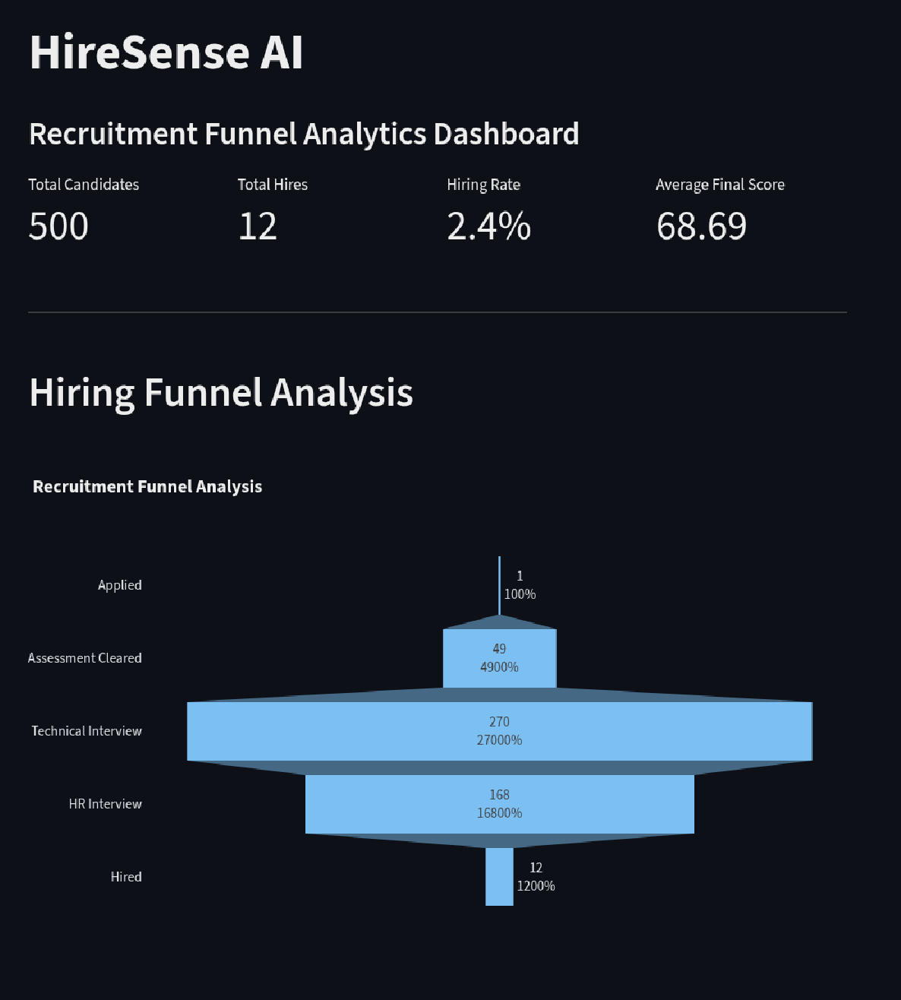
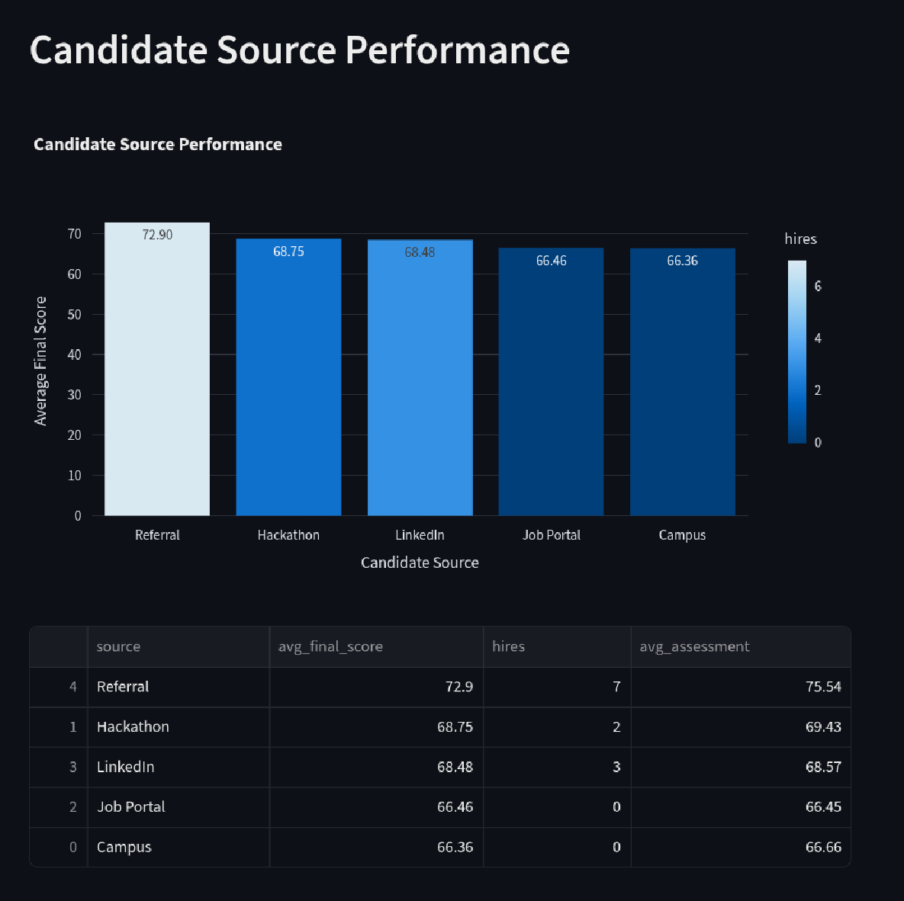
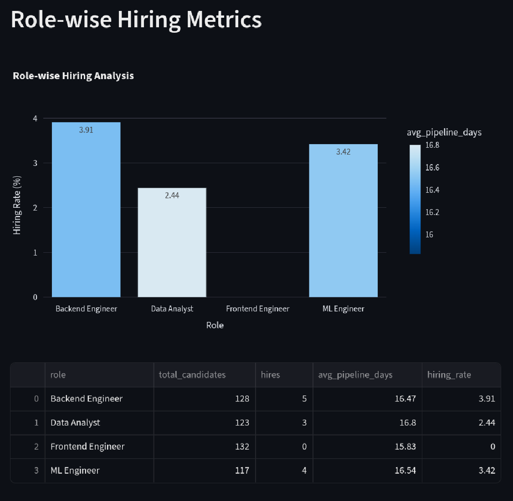
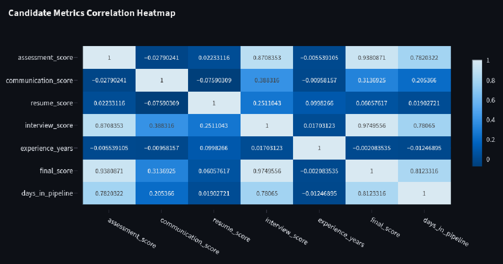
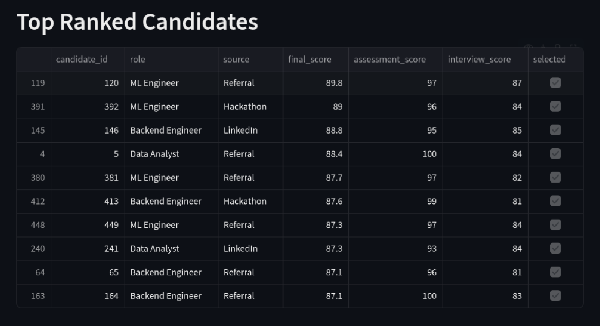

# HireSense AI

AI-assisted recruitment funnel analytics dashboard built with Python, Pandas, Plotly, and Streamlit.

HireSense AI helps analyze candidate progression, hiring conversion, sourcing effectiveness, and recruitment bottlenecks through interactive business intelligence visualizations.

---

# Features

- Interactive recruitment funnel analytics
- Candidate source performance analysis
- Role-wise hiring metrics
- Correlation heatmap for candidate KPIs
- Top candidate ranking system
- Sidebar filtering by role
- Synthetic recruitment dataset generation
- Modular analytics architecture
- Automated testing and validation pipeline

---

# Tech Stack

| Layer | Technology |
|---|---|
| Language | Python 3.11 |
| Data Processing | Pandas |
| Visualization | Plotly |
| Frontend | Streamlit |
| Testing | Pytest |
| Formatting | Black |
| Linting | Ruff |

---

# Architecture

```text
Synthetic Dataset Generator
        ↓
Validation Layer
        ↓
Analytics Engine
        ↓
Visualization Layer
        ↓
Streamlit Dashboard
```

---

# Dashboard Preview

## Recruitment Funnel Analysis



---

## Candidate Source Performance



---

## Role-wise Hiring Metrics



---

## Candidate Correlation Heatmap



---

## Top Ranked Candidates



---

# Installation

## Clone Repository

```bash
git clone https://github.com/Rupesh-Max-na-Ore/HireSense-AI-Recruitment-Analytics
```

## Navigate into Project

```bash
cd HireSense-AI-Recruitment-Analytics
```

## Create Virtual Environment

```bash
python3.11 -m venv .venv
```

## Activate Environment

### Linux/macOS

```bash
source .venv/bin/activate
```

### Windows

```powershell
.venv\Scripts\activate
```

## Install Dependencies

```bash
pip install -r requirements.txt
```

---

# Run Application

```bash
streamlit run app.py
```

---

# Testing

Run automated tests:

```bash
pytest
```

Run linting:

```bash
ruff check .
```

Run formatting:

```bash
black .
```

---

# Future Roadmap

- FastAPI backend integration
- PostgreSQL database migration
- ML-powered candidate ranking
- SHAP-based explainable AI scoring
- Recruiter AI assistant with LLM integration
- NL-to-SQL analytics querying
- Real-time recruitment pipeline monitoring

---

# Project Motivation

This project was designed to explore the intersection of:
- business intelligence,
- recruitment analytics,
- software engineering,
- future AI-assisted hiring systems.

The architecture intentionally supports future expansion into ML systems, backend APIs, and AI-driven recruitment intelligence platforms.